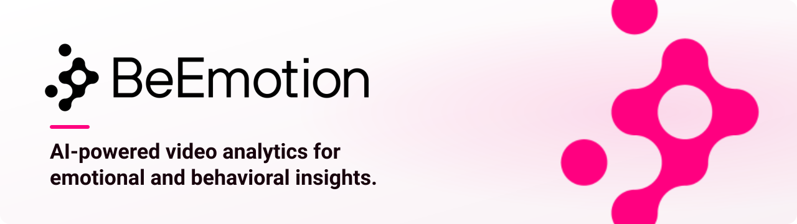
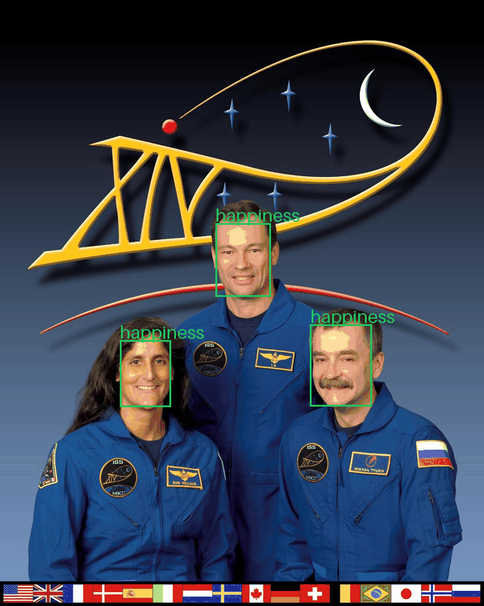
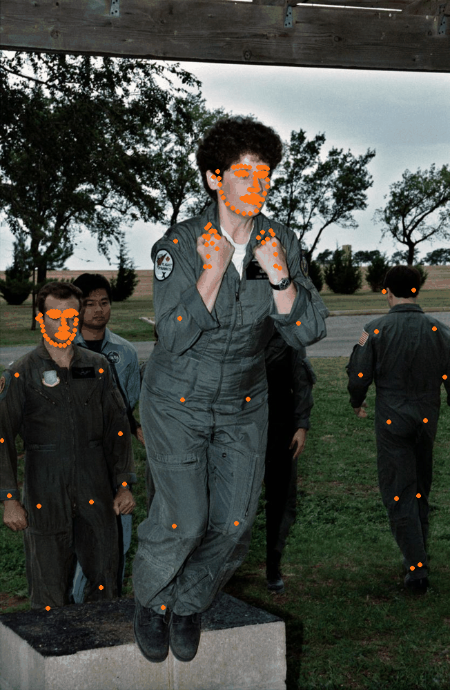
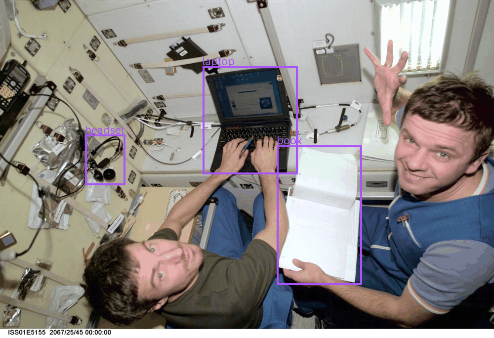

<a href="https://beemotion.app">
  <picture>
    <source media="(prefers-color-scheme: dark)" srcset="assets/banner-dark.svg">
    
  </picture>
</a>

<p align="center">
  <a href="https://beemotion.app"></a>
  <a href="https://docs.beemotion.app"></a>
  <a href="https://api.beemotion.app/v1/openapi.json"></a>
  <a href="https://docs.beemotion.app/guides/mcp-and-skills"></a>
  <a href="https://api.beemotion.app/v1/health"></a>
</p>

### Ready to discover what your audience really feels?

BeEmotion reads faces, emotion, head and body pose, objects, text and speech in images and video. Use it from one REST API, an MCP server for coding agents, or an OpenAI-compatible chat endpoint.

<table>
  <tr>
    <td align="center" width="33%"><br><sub><b>Emotion</b>: seven labels plus valence and arousal</sub></td>
    <td align="center" width="33%"><br><sub><b>Body pose</b>: 133 whole-body keypoints</sub></td>
    <td align="center" width="33%"><br><sub><b>Open-vocabulary detection</b>: find things by name</sub></td>
  </tr>
</table>

## Try it

Create a key at [beemotion.app](https://beemotion.app) under Developer > API keys. New accounts get $5 of free credit, and failed calls are free.

```bash
export BEEMOTION_API_KEY="be_live_..."

curl https://api.beemotion.app/v1/image/analyze \
  -H "Authorization: Bearer $BEEMOTION_API_KEY" \
  -H "Content-Type: application/json" \
  -d '{"image_url": "https://docs.beemotion.app/images/samples/crew-expedition-14.jpg", "tasks": ["face", "emotion"]}'
```

Or ask about an image with the official `openai` SDK:

```python
import os
from openai import OpenAI

client = OpenAI(base_url="https://api.beemotion.app/v1/openai", api_key=os.environ["BEEMOTION_API_KEY"])
response = client.chat.completions.create(
    model="qwen3-vl-2b-instruct",
    messages=[{"role": "user", "content": [
        {"type": "text", "text": "How many people are in the picture?"},
        {"type": "image_url", "image_url": {"url": "https://docs.beemotion.app/images/samples/station-laptops.jpg"}},
    ]}],
)
print(response.choices[0].message.content)
```

## What it does

| Capability | Task | |
|---|---|---|
| Face detection and head pose | `face` | [docs](https://docs.beemotion.app/capabilities/face-detection) |
| Emotion, valence and arousal | `emotion` | [docs](https://docs.beemotion.app/capabilities/emotion) |
| Whole-body pose | `pose` | [docs](https://docs.beemotion.app/capabilities/body-pose) |
| Object detection | `object` | [docs](https://docs.beemotion.app/capabilities/object-detection) |
| Face recognition against your own consented gallery | `recognition` | [docs](https://docs.beemotion.app/capabilities/face-recognition) |
| Captions, OCR and open-vocabulary detection | `caption`, `ocr`, `open_vocab_detection` | [docs](https://docs.beemotion.app/capabilities/captions) |
| Video tracking and speech transcripts | `POST /v1/video/analyze` | [docs](https://docs.beemotion.app/guides/video-and-webhooks) |
| Questions about images | `POST /v1/openai/chat/completions` | [docs](https://docs.beemotion.app/capabilities/chat-with-images) |

## Use it from your coding agent

```bash
claude mcp add --transport http beemotion https://api.beemotion.app/mcp \
  --header "Authorization: Bearer $BEEMOTION_API_KEY"
```

The MCP server works with Claude Code, Cursor, Codex and any Streamable HTTP client. See [MCP and agent skills](https://docs.beemotion.app/guides/mcp-and-skills).

## Repositories

| Repo | What's inside |
|---|---|
| [beem-python](https://github.com/beem-ai/beem-python) | Python SDK and `beemotion` CLI |
| [beem-skills](https://github.com/beem-ai/beem-skills) | Agent skill (`SKILL.md`) and MCP client configs |
| [beem-cookbook](https://github.com/beem-ai/beem-cookbook) | Notebooks, demo apps and starter templates |
| [beem-docs](https://github.com/beem-ai/beem-docs) | Source of [docs.beemotion.app](https://docs.beemotion.app) |

Questions? Email [info@beemotion.ai](mailto:info@beemotion.ai).

<sub>Sample photos: NASA, public domain. Annotations drawn from real BeEmotion API responses.</sub>
